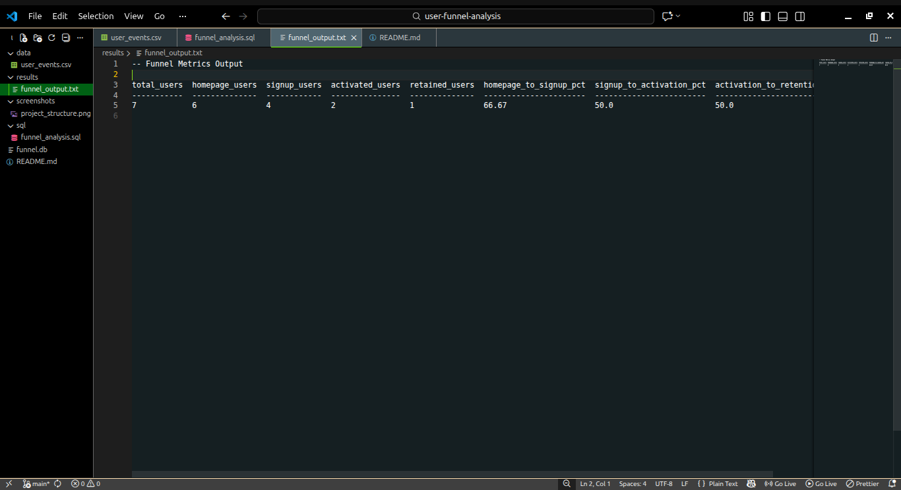
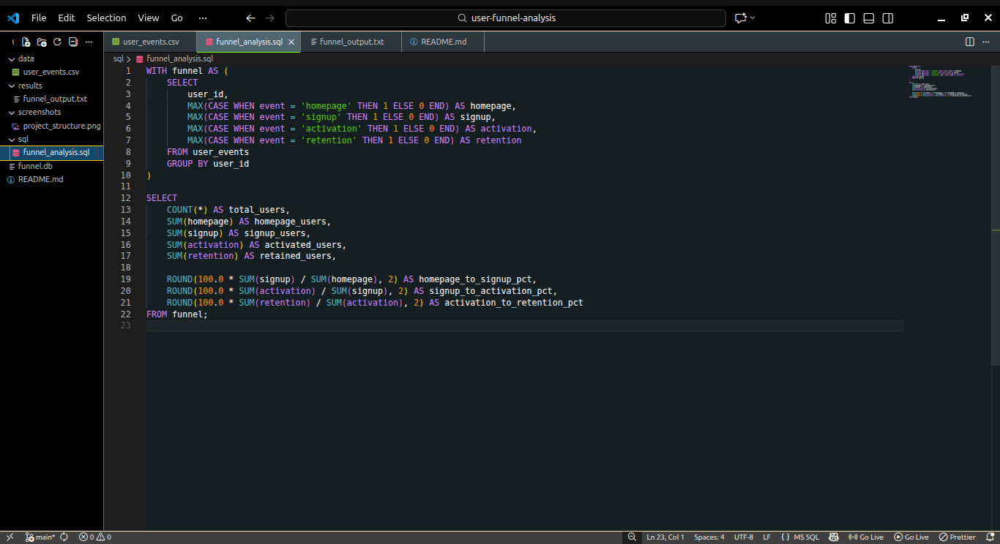
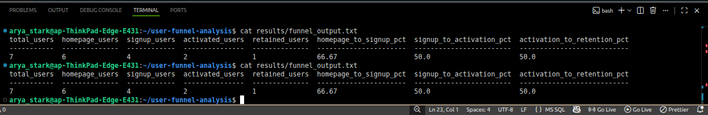
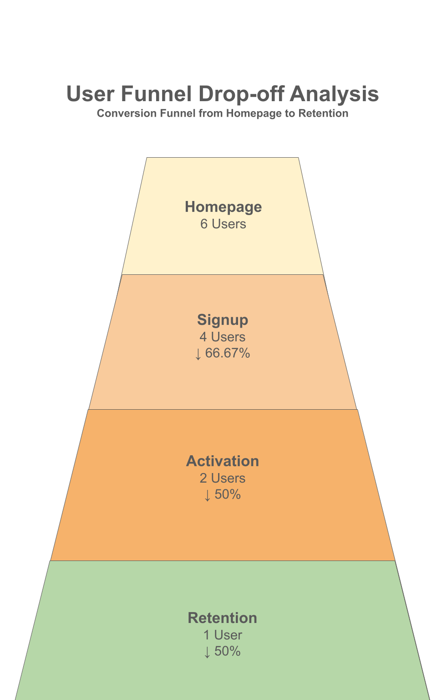

# 🔥 User Funnel Drop-off Analysis for a Digital Product

## 📌 Project Overview
This project performs a complete **product funnel analysis** to understand how users move through a digital product and where they drop off.

**Funnel stages analyzed:**
Homepage → Signup → Activation → Retention

The goal is to help product and growth teams identify bottlenecks, improve onboarding, and increase retention using data-driven insights.

---

## 🧠 Business Questions Answered
- Where do users drop off the most in the product journey?
- What percentage of users convert at each funnel stage?
- How effective are signup, activation, and retention flows?

---

## 🛠️ Tools & Skills Used
- **SQL** (CTEs, conditional aggregation)
- **SQLite** database
- Product funnel & conversion metrics
- Drop-off and retention analysis
- Business-oriented analytical thinking

---

## 📂 Project Structure: 

user-funnel-analysis/
│── data/
│   └── user_events.csv        # Raw user event data
│── sql/
│   └── funnel_analysis.sql    # Funnel calculation logic
│── results/
│   └── funnel_output.txt      # Final funnel metrics
│── screenshots/
│   ├── project_structure.png
│   ├── funnel_sql.png
│   └── funnel_output.png
│── funnel.db                 # SQLite database
│── README.md

## 🧩 Funnel SQL Logic:

The funnel is built using conditional aggregation to track user progression across stages.

▶️ How to Run This Project

1. Install SQLite (if not installed): sudo apt install sqlite3

2. Start the SQLite database: sqlite3 funnel.db

3. Import the dataset: .mode csv
                       .import data/user_events.csv user_events

4. Run the funnel analysis: .read sql/funnel_analysis.sql

5. View the output:cat results/funnel_output.txt

## 📊 Funnel Metrics Output:

## 🔻 Funnel Visualization

## Key Conversion Rates:

- Homepage → Signup: 66.67%

- Signup → Activation: 50%

- Activation → Retention: 50%

## 💡 Key Insights

- Significant user drop-off occurs between Homepage and Signup

- Only half of signed-up users complete activation

- Retention is limited to a small subset of activated users

## 🎯 Practical Business Use

This analysis can help:

- Product teams improve onboarding experience

- Growth teams optimize acquisition channels

- UX teams reduce friction in signup flows

- Leadership make data-backed product decisions

## 📚 What I Learned

- Designing real-world product funnels using event-level data

- Writing clean and scalable SQL for analytics

- Calculating and interpreting conversion and drop-off metrics

- Translating analytical results into business insights

👩‍💻 Author

Aishwarya Priydarshni
Aspiring Data Analyst | SQL | Product Analytics | Data Visualization

